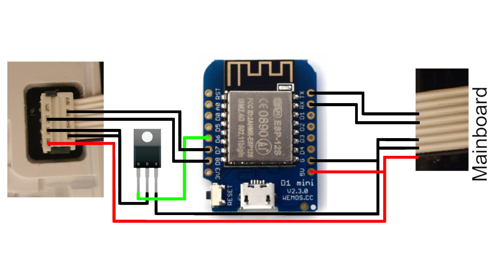

# Philips Automation for EP1220 Espresso Machine with Webserver on ESP 8266

## This Repo was started on the great work of TillFleisch

This project integrates a Philips Series 1200 Coffee Machine using an ESP8266 microcontroller and ESPHome. 

For other models like Series 2200 and Series 3200 please refer to original project at 

(https://github.com/TillFleisch/ESPHome-Philips-Smart-Coffee/)

This component provides a `Power Switch`, a `Relay to re-power the Display of the coffemachine` and various `Buttons` which simulate user input as well as a `Number` component to customize beverage settings such as size and strength.
The `Power Switch` can be used to turn on the coffee machine with and without a cleaning cycle during startup.

You might break/brick your coffee machine by modifying it in any way, shape or form. If you want to use this component, do so at your own risk.

# Configuration variables

A example configuration can be found [here](example.yaml)

## Philips Coffee Machine

- **id**(**Required**, string):Controller ID which will be used for entity configuration.
- **display_uart**(**Required**, string): ID of the UART-Component connected to the display unit
- **mainboard_uart**(**Required**, string): ID of the UART-Component connected to the mainboard
- **relay_pin**(**Required**, Pin to which the Relay is connected. This pin is used to temporarily turn of the display unit. In my case the relay needs to be set to OUTPUT_OPEN_DRAIN in order to be able to correctly trigger the display off and back on.
- **power_message_repetitions**(**Optional**: uint): Determines how many message repetitions are used while turning on the machine. On some hardware combinations a higher value such as `25` is required to turn on the display successfully. Defaults to `5`.
- **language**(**Optional**: int): Status sensor language. Select one of `en-US`, `de-DE`, `it-IT`. Defaults to `en-US`.
- **model**(**Optional**: int): Different models or revisions may use different commands. This option can be used to specify the command set used by this component. Select one of `EP_2220`, `EP_2235`, `EP_3243`, `EP_3246`. Defaults to `EP_2220`. This code works with model: "EP_2220" as this works with ESP_1220 model.

## Philips Power switch

- **controller_id**(**Required**, string): The Philips Coffee Machine-Controller to which this entity belongs
- **clean**(**Optional**: boolean): If set to `true` the machine will perform a cleaning cycle during startup. Otherwise the machine will power on without cleaning. Defaults to `true`.
- All other options from [Switch](https://esphome.io/components/switch/index.html#config-switch)

## Action Button

- **controller_id**(**Required**, string): The Philips Coffee Machine-Controller to which this entity belongs
- **action**(**Required**, int): The action performed by this button. Select one of `SELECT_COFFEE`, `MAKE_COFFEE`, `SELECT_ESPRESSO`, `MAKE_ESPRESSO`, `SELECT_HOT_WATER`, `MAKE_HOT_WATER`, `SELECT_STEAM`, `MAKE_STEAM`, `SELECT_CAPPUCCINO`, `MAKE_CAPPUCCINO`, `SELECT_LATTE`, `MAKE_LATTE`, `SELECT_AMERICANO`, `MAKE_AMERICANO`, `BEAN`, `SIZE`, `MILK`, `AQUA_CLEAN`, `CALC_CLEAN`, `PLAY_PAUSE`. Note that some options are only available on select models.
- **long_press**(**Optional**, boolean): If set to `true` this button will perform a long press. This option is only available for actions which don't include `MAKE`.
- All other options from [Button](https://esphome.io/components/button/index.html#config-button)

## Philips Display Power Control

- **id**(**Required**, string): The Philips Coffee Machine-Controller to which this entity belongs
- All other options from [Text Sensor](https://esphome.io/components/text_sensor/index.html#config-text-sensor)

## Bean and Size Settings

- **type**(**Required**, string): The type of this number component. One of `size`, `bean` and `milk`. If `size` is selected, this component will report/manipulate the beverage size. If `bean` is used, this component will report/manipulate the beverage strength. If `milk` is used, this component will report/manipulate the amount of milk added to the beverage. Note that some options are only available on select models.
- **controller_id**(**Required**, string): The Philips Coffee Machine-Controller to which this entity belongs
- **status_sensor_id**(**Required**, string): Id of a status sensor which is also connected to the controller.
- **source**(**Optional**, int): The source of this sensor. If non is provided, any selected beverage will enable this component. Select one of `COFFEE`, `ESPRESSO`, `HOT_WATER`, `CAPPUCCINO`, `AMERICANO`, `LATTE_MACCHIATO`. Note that some options are only available on select models or setting types.
- All other options from [Number](https://esphome.io/components/number/index.html#config-number)

# Wiring

The coffee machines display unit is connected to the mainboard via a 8-pin ribbon cable with Picoflex connectors.
The display is powered by the mainboard and the two units communicate using a serial bus.
The ESP is placed in between this bus to perform a man-in-the-middle attack.
The RX/TX lines are not piped through the ESP such that messages can be read, intercepted and injected, you can only inject messages to the mainboard.

When injecting a 'turn coffee machine on' command, the coffee machine does turn on, but the display unit does not. To circumvent this behavior we can re-boot the display unit by temporarily removing it's power. Thus the display will power on and operate normally. To perform this operation a relay was used.

The following wiring guideline can be used to add a Node MCU ESP8266 to the coffee machine. **The unlabeled wires should be connected without changes.** More schematics are available [here](#custom-pcb).

The ribbon cable wires have the following functionalities.

| Pin | Mainboard | Functionality                      |
| --- | --------- | ---------------------------------- |
| 1   | 5V        | 5V                                 |
| 2   | GND       | GND                                |
| 3   | GND       | GND                                |
| 4   | unused    | unused                             |
| 5   | TX/RX     | Messages from mainboard to display |
| 6   | RX/TX     | Messages from display to mainboard |
| 7   | 0V        | unknown - very noisy               |
| 8   | 5V        |                                    |

1. Connect pin1 of the mainboard to pin1 of display and NodeMCU VIN, and to VCC of the Relay
2. Connect pin2 and pin3 of the mainboard to Ground pin of the NodeMCU, connect same pin2 and pin3 from mainboard to Relay to NormalClose
3. Pin 4 connecto mainboard to display as it was originally
4. Pin 5 of the display connect to pin 6 of the mainboard (like this the mainboard get's all the messages from the display)
5. Pin 6 of the mainboard connect to GPIO1 on NodeMCU
6. Pin 6 of the display connect GPI3 of the NodeMCU
7. Pin 7 of the display connected to pin 7 of the mainboard
8. Pin 8 of the display connected to pin 8 of the mainboard

With this wiring the Display can still send messages to the mainboard as it did before. But wiring the pin 6 of the mainboard to NodeMcu we can inject messages to tell the mainboard to power on, make coffee etc... and the relay is then powering on the display.

## Voltage regulation

The Node MCU ESP has a voltage regulator, that means you can power the ESP using the mainboard 5V, by using the VIN pin.

# Related Work

- [SmartPhilips2200](https://github.com/chris7topher/SmartPhilips2200) by [@chris7topher](https://github.com/chris7topher)
  - The commands used in this Project are different. This is likely due to different model revisions.
- Thanks to [@quack3d](https://github.com/quack3d) and [@sendorm](https://github.com/sendorm) for helping add support for the `EP3243` and the `EP3246`.
- Thank to (https://github.com/TillFleisch/ESPHome-Philips-Smart-Coffee/) as it was possible for me to automate my EP1220 machine based on his code and findings.

# Troubleshooting

- Make sure your wiring is correct
- The UART debug function can be used to analyze communication and verify correct wiring
- The commands used by the display unit may be different between different revisions/models (see Related Work)
